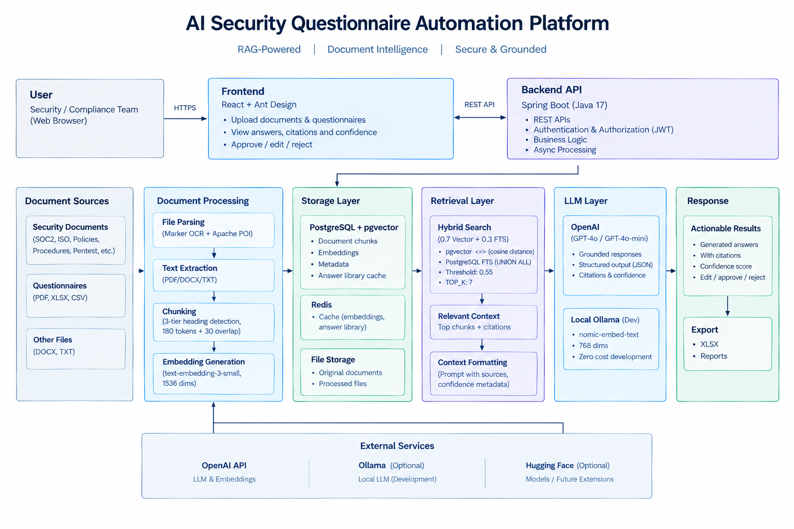

# AI Security Questionnaire Automation Platform

A RAG-powered platform that automates security questionnaire responses using an organization's security documentation.

The system retrieves relevant evidence from uploaded security documents, generates grounded answers using an LLM, provides citations and confidence scores, and keeps a human reviewer in the loop.

## Architecture



## Key Capabilities

* Upload security documents and questionnaires
* PDF, DOCX, TXT, XLSX and CSV processing
* OCR fallback for scanned PDFs
* Structure-aware document chunking
* Semantic search using embeddings and pgvector
* Hybrid retrieval using vector search + PostgreSQL FTS
* Query normalization and domain synonym expansion
* RAG-based answer generation
* Source citations and evidence
* Heuristic confidence scoring
* Human review: approve, edit or reject
* Semantic answer library to reuse previously approved answers
* XLSX/report export

## RAG Pipeline

### 1. Document Ingestion

```text
Document Upload
      ↓
Text Extraction
      ↓
Text Cleaning
      ↓
Structure-Aware Chunking
      ↓
Embedding Generation
      ↓
PostgreSQL + pgvector
```

Digital PDFs use PDFBox, while scanned PDFs fall back to a Dockerized Marker OCR service. DOCX files are processed using Apache POI. Documents are split using heading-aware chunking with 180-token chunks and 30-token overlap.

### 2. Answer Generation

```text
Question
   ↓
Query Normalization
   ↓
Embedding + Keyword Extraction
   ↓
Hybrid Retrieval
   ├── Vector Search
   └── PostgreSQL FTS
   ↓
Top-K Context
   ↓
LLM
   ↓
Answer + Evidence
   ↓
Confidence Score
   ↓
Human Review
```

Hybrid retrieval combines semantic similarity and lexical relevance using a 70/30 weighting, with `TOP_K = 7`.

## Technology Stack

| Layer               | Technology                      |
| ------------------- | ------------------------------- |
| Frontend            | React, Ant Design               |
| Backend             | Java 17, Spring Boot            |
| Database            | PostgreSQL                      |
| Vector Search       | pgvector                        |
| Cache               | Redis                           |
| Document Processing | PDFBox, Apache POI, Marker OCR  |
| LLM                 | OpenAI / Ollama                 |
| Embeddings          | OpenAI `text-embedding-3-small` |
| Authentication      | JWT                             |
| Build / Deployment  | Docker, CI/CD                   |

## Design Highlights

* **Structure-aware chunking** — Preserves document hierarchy using headings and section boundaries.
* **Hybrid retrieval** — Combines pgvector semantic search with PostgreSQL full-text search.
* **Grounded generation** — LLM answers are generated only from retrieved evidence.
* **Human review** — Answers can be reviewed, edited, approved, or rejected.
* **Answer reuse** — Approved answers are semantically matched and reused for similar questions.
* **Async processing** — Long-running document and questionnaire processing runs asynchronously.
